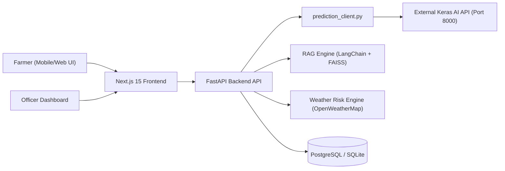

# AgriRakshak — AI Crop Disease & Pest Detection Platform

AgriRakshak is a production-quality full-stack AI crop protection MVP built for the **Smart India Hackathon (SIH)**. It helps farmers detect crop diseases/pests from leaf photos, receive safe advisories in simple language (English/Hindi), evaluate weather risk alerts, and escalate low-confidence cases to agricultural experts. Extension officers get a dedicated monitoring dashboard featuring disease outbreak maps, heatmaps, analytics, and an expert review queue.

---

## 🏗 Architecture Overview



---

## ✨ Features

1. **AI Crop Disease & Pest Detection**:
   - Accepts leaf image uploads (Camera/Gallery/Drag & Drop).
   - Communicates with existing FastAPI/Keras model (`POST /predict`).
   - Normalizes prediction responses and applies thresholding (`0.60`).
2. **Farmer AI & RAG Chatbot**:
   - Answers agricultural questions using curated local knowledge base (`backend/app/knowledge_base/`).
   - Strict domain guardrails preventing hallucinated pesticide dosages.
3. **Structured Advisory Engine**:
   - Emits standardized JSON advisories: `diagnosis_or_answer`, `recommended_actions`, `safety_notes`, `escalation_flag`.
4. **Multilingual Support (English & Hindi)**:
   - Dynamic localization of diagnoses, action steps, and safety precautions.
5. **Weather Disease Risk System**:
   - Integrates OpenWeatherMap API and evaluates humidity, temperature, and 3-day forecast against fungal/pest outbreak rules.
6. **Expert Escalation Queue**:
   - Auto-escalates predictions with confidence < 60% to agricultural officers.
   - Officers can confirm diagnosis and record expert notes.
7. **Officer Monitoring Dashboard**:
   - Real-time total cases, today's cases, high risk areas, and pending review metrics.
   - Interactive Leaflet outbreak map with category filters and heatmap view toggle.
   - Recharts visual analytics (cases over time, top diseases, crop distribution, regional density).

---

## 🛠 Tech Stack

- **Frontend**: Next.js 15+, React 19, TypeScript, Tailwind CSS, Lucide React, Recharts, Leaflet / React-Leaflet.
- **Backend**: Python 3.11+, FastAPI, SQLAlchemy, SQLite / PostgreSQL / PostGIS, Pydantic v2, PyJWT, bcrypt.
- **AI / RAG**: LangChain, FAISS, OpenAI / Claude LLM integration.
- **External AI Microservice**: Keras/TensorFlow model on `http://127.0.0.1:8000`.

---

## 🚀 Quick Start & Local Setup

### 1. Environment Setup
Copy example environment files:
```bash
# Backend
cp backend/.env.example backend/.env

# Frontend
cp frontend/.env.local.example frontend/.env.local
```

### 2. Start Backend API
```bash
cd backend
python -m venv venv
venv\Scripts\activate   # On Windows
pip install -r requirements.txt
python seed_knowledge_base.py
python seed_demo_data.py
uvicorn app.main:app --host 0.0.0.0 --port 8001 --reload
```
- Backend Swagger Docs: `http://localhost:8001/docs`

### 3. Start Frontend App
```bash
cd frontend
npm install
npm run dev
```
- Frontend Portal: `http://localhost:3000`
- Farmer Portal: `http://localhost:3000/farmer`
- Officer Login: `http://localhost:3000/login`

---

## 🔑 Demo Credentials

- **Officer Login**:
  - **Username**: `officer`
  - **Password**: `officer123`

---

## 📜 Core API Endpoints

| Method | Endpoint | Description |
| :--- | :--- | :--- |
| `GET` | `/health` | API & Prediction microservice health check |
| `POST` | `/auth/login` | Officer JWT authentication |
| `POST` | `/chat/message` | Primary farmer interaction endpoint (Text / Base64 image) |
| `POST` | `/prediction/analyze` | Direct multipart leaf image upload endpoint |
| `GET` | `/weather/risk` | Weather risk alert evaluation |
| `GET` | `/reports` | Recorded crop cases history |
| `GET` | `/reports/escalations` | Pending expert review queue |
| `POST` | `/reports/escalations/{id}/resolve` | Confirm diagnosis & resolve escalation |
| `GET` | `/dashboard/stats` | Officer dashboard KPI statistics |
| `GET` | `/dashboard/cases` | All cases registry |
| `GET` | `/dashboard/diseases` | Disease distribution data |
